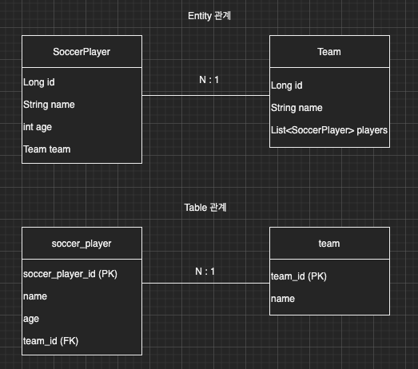

이번 장에서는 Querydsl의 기본 문법에 대해서 알아본다.
글의 하단부에 참고한 강의와 공식문서의 경로를 첨부하였으므로 자세한 사항은 강의나 공식문서에서 확인한다.
모든 코드는 [깃허브 (링크)](https://github.com/roy-zz/querydsl)에 올려두었다.

---

두 개의 Entity인 축구선수(SoccerPlayer)와 선수들이 속해있는 팀(Team)을 가지고 예를 들어본다.



**SoccerPlayer**

```java
@Entity
@Getter @Setter
@ToString(of = {"id", "name", "height", "weight"})
@NoArgsConstructor(access = PROTECTED)
public class SoccerPlayer {

    @Id @GeneratedValue
    @Column(name = "soccer_player_id")
    private Long id;
    private String name;
    private int height;
    private int weight;

    @ManyToOne(fetch = LAZY, cascade = ALL)
    @JoinColumn(name = "team_id")
    private Team team;

    public SoccerPlayer(String name) {
        this(name, 0);
    }

    public SoccerPlayer(String name, int height) {
        this(name, height, 0);
    }

    public SoccerPlayer(String name, int height, int weight) {
        this(name, height, weight, null);
    }

    public SoccerPlayer(String name, int height, int weight, Team team) {
        this.name = name;
        this.height = height;
        this.weight = weight;
        if (Objects.nonNull(team)) {
            changeTeam(team);
        }
    }

    public void changeTeam(Team team) {
        this.team = team;
        team.getSoccerPlayers().add(this);
    }
}
```

**Team**

```java
@Entity
@Getter @Setter
@ToString(of = {"id", "name"})
@NoArgsConstructor(access = PROTECTED)
public class Team {

    @Id
    @GeneratedValue
    @Column(name = "team_id")
    private Long id;
    private String name;

    @OneToMany(mappedBy = "team")
    private List<SoccerPlayer> soccerPlayers = new ArrayList<>();

    public Team(String name) {
        this.name = name;
    }
}
```

모든 테스트를 진행하기 이전에 테스트 데이터를 넣기 위해 아래와 같이 @BeforeEach가 붙은 메서드를 만든다.
각각의 테스트가 실행되기 이전에 먼저 실행되어 DB에 데이터를 넣어줄 것이다.
SoccerPlayer과 Team은 연결할 때 cascade = ALL로 하였기 때문에 SoccerPlayer만 저장하여도 팀까지 같이 저장된다.

```java
@Transactional
@SpringBootTest
public class QuerydslBasicGrammarTest {

    @Autowired
    private EntityManager entityManager;

    @BeforeEach
    public void before() {
        Team teamA = new Team("TeamA");
        Team teamB = new Team("TeamB");
        List<SoccerPlayer> players = List.of(
                new SoccerPlayer("Roy", 173, 73, teamA),
                new SoccerPlayer("Perry", 175, 75, teamA),
                new SoccerPlayer("Sally", 160, 60, teamB),
                new SoccerPlayer("Dice", 183, 83, teamB)
        );
        players.forEach(i -> entityManager.persist(i));
    }
}
```

### 파라미터 바인딩


---

**참고한 강의:**

- https://www.inflearn.com/course/Querydsl-%EC%8B%A4%EC%A0%84
- https://www.inflearn.com/course/%EC%8A%A4%ED%94%84%EB%A7%81-%EB%8D%B0%EC%9D%B4%ED%84%B0-JPA-%EC%8B%A4%EC%A0%84
- https://www.inflearn.com/course/%EC%8A%A4%ED%94%84%EB%A7%81%EB%B6%80%ED%8A%B8-JPA-API%EA%B0%9C%EB%B0%9C-%EC%84%B1%EB%8A%A5%EC%B5%9C%EC%A0%81%ED%99%94
- https://www.inflearn.com/course/%EC%8A%A4%ED%94%84%EB%A7%81%EB%B6%80%ED%8A%B8-JPA-%ED%99%9C%EC%9A%A9-1
- https://www.inflearn.com/course/ORM-JPA-Basic

**JPA 공식 문서:** https://docs.spring.io/spring-data/jpa/docs/current/reference/html/#reference

**위키백과:** https://ko.wikipedia.org/wiki/%EC%9E%90%EB%B0%94_%ED%8D%BC%EC%8B%9C%EC%8A%A4%ED%84%B4%EC%8A%A4_API