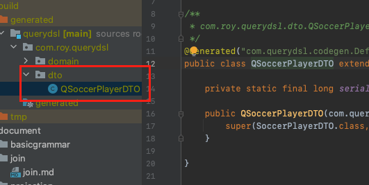

이번 장에서는 Querydsl의 프로젝션에 대해서 알아본다.
글의 하단부에 참고한 강의와 공식문서의 경로를 첨부하였으므로 자세한 사항은 강의나 공식문서에서 확인한다.
모든 코드는 [깃허브 (링크)](https://github.com/roy-zz/querydsl)에 올려두었다.

---

프로젝션이란 Select의 조회의 대상을 지정하는 것을 말한다.

```sql
SELECT
    SP.name, SP.height, SP.weight
FROM
    soccer_player SP
```

이러한 SQL문이 있을 때 프로젝션 대상은 이름, 키, 몸무게 총 세 개가 된다.

Querydsl에서도 이러한 프로젝션이 가능하다.
프로젝션 대상이 단수인 경우 정확한 타입을 지정할 수 있지만
프로젝션 대상이 복수인 경우 Tuple나 DTO로 조회해야한다.

---

### Tuple

프로젝션 대상이 SoccerPlayer의 name과 height이고 Tuple을 사용하여 조회해본다.

```java
@Transactional
@SpringBootTest
@TestMethodOrder(value = OrderAnnotation.class)
public class QuerydslBasicGrammarTest {
    @Autowired
    private EntityManager entityManager;
    private JPAQueryFactory query;
    @Test
    @Order(26)
    @DisplayName("Tuple을 사용한 프로젝션 테스트")
    void projectionUsingTupleTest() {
        List<Tuple> tuples = query
                .select(
                        soccerPlayer.name,
                        soccerPlayer.height)
                .from(soccerPlayer)
                .fetch();

        tuples.forEach(tuple -> {
            System.out.println("선수의 이름: " + tuple.get(soccerPlayer.name));
            System.out.println("선수의 키: " + tuple.get(soccerPlayer.height));
        });
    }
}
```

출력 결과는 아래와 같다.

```bash
선수의 이름: Roy
선수의 키: 173
선수의 이름: Perry
선수의 키: 175
선수의 이름: Sally
선수의 키: 160
선수의 이름: Dice
선수의 키: 183
```

---

### DTO

조회에 사용할 DTO 클래스는 아래와 같다.

```java
@Data
@EqualsAndHashCode
@NoArgsConstructor
public class SoccerPlayerDTO {
    private String name;
    private int height;

    public SoccerPlayerDTO(String name, int height) {
        this.name = name;
        this.height = height;
    }
}
```

순수 JPA에서 DTO로 조회하는 경우 new 를 사용해야하며 패키지 경로를 모두 적어주어야 하기 때문에 지저분하다.
또한 생성자를 통한 DTO 생성만 가능하다.

```java
@Transactional
@SpringBootTest
@TestMethodOrder(value = OrderAnnotation.class)
public class QuerydslBasicGrammarTest {
    @Autowired
    private EntityManager entityManager;
    private JPAQueryFactory query;
    @Test
    @Order(27)
    @DisplayName("순수 JPA DTO 조회 테스트")
    void pureJpaFindDTOTest() {
        assertDoesNotThrow(() -> {
            entityManager.createQuery(
                            "SELECT new com.roy.querydsl.dto.SoccerPlayerDTO(SP.name, SP.height) " +
                                    "FROM SoccerPlayer SP " +
                                    "WHERE SP.name = :name ", SoccerPlayerDTO.class)
                    .setParameter("name", "Roy")
                    .getSingleResult();
        });
    }
}
```

querydsl에서 DTO로 조회하는 방법은 총 네가지가 있다.

**프로퍼티 접근**

```java
@Transactional
@SpringBootTest
@TestMethodOrder(value = OrderAnnotation.class)
public class QuerydslBasicGrammarTest {
    @Autowired
    private EntityManager entityManager;
    private JPAQueryFactory query;
    @Test
    @Order(28)
    @DisplayName("DTO 조회 프로퍼티 접근 테스트")
    void createDTOPropertyAccess() {
        SoccerPlayerDTO pureJpaDTO = entityManager.createQuery(
                        "SELECT new com.roy.querydsl.dto.SoccerPlayerDTO(SP.name, SP.height) " +
                                "FROM SoccerPlayer SP " +
                                "WHERE SP.name = :name ", SoccerPlayerDTO.class)
                .setParameter("name", "Roy")
                .getSingleResult();

        SoccerPlayerDTO dslDTO = query
                .select(Projections.bean(SoccerPlayerDTO.class,
                        soccerPlayer.name, soccerPlayer.height))
                .from(soccerPlayer)
                .where(soccerPlayer.name.eq("Roy"))
                .fetchOne();

        assertEquals(dslDTO, pureJpaDTO);
    }
}
```

---

**필드직접 접근**

```java
@Transactional
@SpringBootTest
@TestMethodOrder(value = OrderAnnotation.class)
public class QuerydslBasicGrammarTest {
    @Autowired
    private EntityManager entityManager;
    private JPAQueryFactory query;
    @Test
    @Order(29)
    @DisplayName("DTO 조회 필드 직접 접근 테스트")
    void createDTOFieldAccess() {
        SoccerPlayerDTO pureJpaDTO = entityManager.createQuery(
                        "SELECT new com.roy.querydsl.dto.SoccerPlayerDTO(SP.name, SP.height) " +
                                "FROM SoccerPlayer SP " +
                                "WHERE SP.name = :name ", SoccerPlayerDTO.class)
                .setParameter("name", "Roy")
                .getSingleResult();

        SoccerPlayerDTO dslDTO = query
                .select(Projections.fields(SoccerPlayerDTO.class,
                        soccerPlayer.name, soccerPlayer.height))
                .from(soccerPlayer)
                .where(soccerPlayer.name.eq("Roy"))
                .fetchOne();

        assertEquals(dslDTO, pureJpaDTO);
    }
}
```

---

**생성자 사용**

```java
@Transactional
@SpringBootTest
@TestMethodOrder(value = OrderAnnotation.class)
public class QuerydslBasicGrammarTest {
    @Autowired
    private EntityManager entityManager;
    private JPAQueryFactory query;
    @Test
    @Order(30)
    @DisplayName("DTO 조회 생성자 사용 테스트")
    void createDTOUsingConstructorTest() {
        SoccerPlayerDTO pureJpaDTO = entityManager.createQuery(
                        "SELECT new com.roy.querydsl.dto.SoccerPlayerDTO(SP.name, SP.height) " +
                                "FROM SoccerPlayer SP " +
                                "WHERE SP.name = :name ", SoccerPlayerDTO.class)
                .setParameter("name", "Roy")
                .getSingleResult();

        SoccerPlayerDTO dslDTO = query
                .select(Projections.constructor(SoccerPlayerDTO.class,
                        soccerPlayer.name, soccerPlayer.height))
                .from(soccerPlayer)
                .where(soccerPlayer.name.eq("Roy"))
                .fetchOne();

        assertEquals(dslDTO, pureJpaDTO);
    }
}
```

---

프로퍼티나 필드 직접 접근은 변수의 이름이 중요하다.
만약 이름이 다른 경우는 아래와 같이 ExpressionUtils.as()나 field.as()를 사용하여 해결한다.

조회의 대상은 아래와 같다.

```java
@Data
@EqualsAndHashCode
@NoArgsConstructor
public class StrangeSoccerPlayerDTO {
    private String whatYourName;
    private int howTallAreYou;

    public StrangeSoccerPlayerDTO(String whatYourName, int howTallAreYou) {
        this.whatYourName = whatYourName;
        this.howTallAreYou = howTallAreYou;
    }
}
```

사용법은 아래와 같다.

```java
@Transactional
@SpringBootTest
@TestMethodOrder(value = OrderAnnotation.class)
public class QuerydslBasicGrammarTest {
    @Autowired
    private EntityManager entityManager;
    private JPAQueryFactory query;
    @Test
    @Order(31)
    @DisplayName("필드명이 다른 DTO 조회 테스트")
    void notEqualFieldNameTest() {
        StrangeSoccerPlayerDTO strangeDto = query
                .select(Projections.fields(StrangeSoccerPlayerDTO.class,
                        soccerPlayer.name.as("whatYourName"),
                        ExpressionUtils.as(
                                soccerPlayer.height, "howTallAreYou")))
                .from(soccerPlayer)
                .where(soccerPlayer.name.eq("Roy"))
                .fetchOne();

        assertNotNull(strangeDto.getWhatYourName());
        assertNotNull(strangeDto.getHowTallAreYou());
        assertEquals("Roy", strangeDto.getWhatYourName());
        assertEquals(173, strangeDto.getHowTallAreYou());
    }
}
```

---

**@QueryProjection 활용**

컴파일러로 타입 체크할 수 있는 가장 안전한 방법이다.
하지만 DTO에 querydsl 의존성이 있는 어노테이션이 추가되며 DTO까지 Q파일이 생성된다는 단점이 있다.

@QueryProjection을 생성자에 추가해준다.

```java
@Data
@EqualsAndHashCode
@NoArgsConstructor
public class SoccerPlayerDTO {
    private String name;
    private int height;

    @QueryProjection
    public SoccerPlayerDTO(String name, int height) {
        this.name = name;
        this.height = height;
    }
}
```

이렇게 어노테이션을 추가하고 compileQuerydsl을 실행시키면 아래와 같이 DTO Q파일이 생성되는 것을 확인할 수 있다.



```java
@Transactional
@SpringBootTest
@TestMethodOrder(value = OrderAnnotation.class)
public class QuerydslBasicGrammarTest {
    @Autowired
    private EntityManager entityManager;
    private JPAQueryFactory query;
    @Test
    @Order(30)
    @DisplayName("DTO 조회 @QueryProjection 테스트")
    void createDTOQueryProjection() {
        SoccerPlayerDTO pureJpaDTO = entityManager.createQuery(
                        "SELECT new com.roy.querydsl.dto.SoccerPlayerDTO(SP.name, SP.height) " +
                                "FROM SoccerPlayer SP " +
                                "WHERE SP.name = :name ", SoccerPlayerDTO.class)
                .setParameter("name", "Roy")
                .getSingleResult();

        SoccerPlayerDTO dslDTO = query
                .select(new QSoccerPlayerDTO(soccerPlayer.name, soccerPlayer.height))
                .from(soccerPlayer)
                .where(soccerPlayer.name.eq("Roy"))
                .fetchOne();

        assertEquals(dslDTO, pureJpaDTO);
    }
}
```

---

**참고한 강의:**

- https://www.inflearn.com/course/Querydsl-%EC%8B%A4%EC%A0%84
- https://www.inflearn.com/course/%EC%8A%A4%ED%94%84%EB%A7%81-%EB%8D%B0%EC%9D%B4%ED%84%B0-JPA-%EC%8B%A4%EC%A0%84
- https://www.inflearn.com/course/%EC%8A%A4%ED%94%84%EB%A7%81%EB%B6%80%ED%8A%B8-JPA-API%EA%B0%9C%EB%B0%9C-%EC%84%B1%EB%8A%A5%EC%B5%9C%EC%A0%81%ED%99%94
- https://www.inflearn.com/course/%EC%8A%A4%ED%94%84%EB%A7%81%EB%B6%80%ED%8A%B8-JPA-%ED%99%9C%EC%9A%A9-1
- https://www.inflearn.com/course/ORM-JPA-Basic

**JPA 공식 문서:** https://docs.spring.io/spring-data/jpa/docs/current/reference/html/#reference

**위키백과:** https://ko.wikipedia.org/wiki/%EC%9E%90%EB%B0%94_%ED%8D%BC%EC%8B%9C%EC%8A%A4%ED%84%B4%EC%8A%A4_API