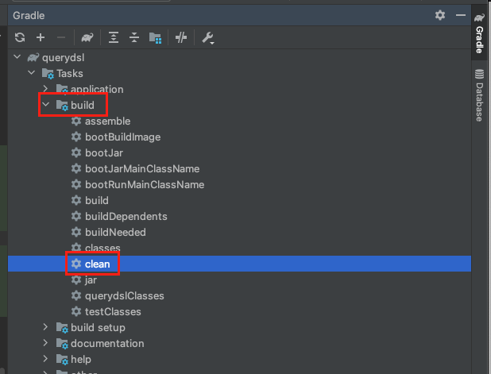
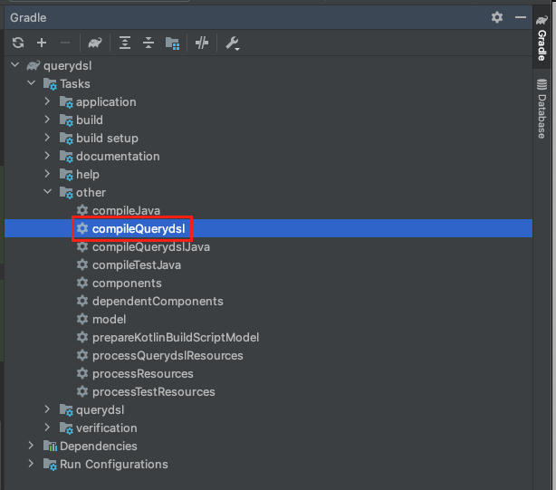
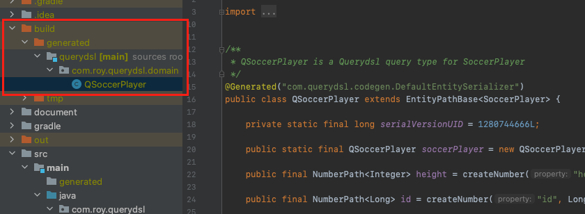

이번 장에서는 Querydsl을 위한 초기 설정에 대해서 알아본다.
글의 하단부에 참고한 강의와 공식문서의 경로를 첨부하였으므로 자세한 사항은 강의나 공식문서에서 확인한다.
모든 코드는 [깃허브 (링크)](https://github.com/roy-zz/querydsl)에 올려두었다.

---

프로젝트를 생성하는 방법에 대해서는 다루지 않는다.
만약 Spring Boot 프로젝트 생성이 익숙치 않다면 필자가 이전에 [작성한 글 (링크)](https://imprint.tistory.com/3?category=1003393)을 참고한다.

---

### build.gradle

**Spring 2.6 이후, Gradle 5.0 이후**

```gradle
plugins {
    id 'org.springframework.boot' version '2.6.5'
    id 'io.spring.dependency-management' version '1.0.11.RELEASE'
    // querydsl ---------------------------------------------
    id 'com.ewerk.gradle.plugins.querydsl' version '1.0.10'
    // querydsl ---------------------------------------------
    id 'java'
}

group = 'com.roy'
version = '0.0.1-SNAPSHOT'
sourceCompatibility = '11'

configurations {
    compileOnly {
        extendsFrom annotationProcessor
    }
}

repositories {
    mavenCentral()
}

dependencies {
    implementation 'org.springframework.boot:spring-boot-starter-data-jpa'
    implementation 'org.springframework.boot:spring-boot-starter-web'

    // querydsl ---------------------------------------------
    implementation 'com.querydsl:querydsl-jpa'
    implementation 'com.querydsl:querydsl-apt'
    // querydsl ---------------------------------------------

    compileOnly 'org.projectlombok:lombok'

    runtimeOnly 'com.h2database:h2'

    annotationProcessor 'org.projectlombok:lombok'

    testImplementation 'org.springframework.boot:spring-boot-starter-test'
}

tasks.named('test') {
    useJUnitPlatform()
}

// querydsl ---------------------------------------------------
def querydslDir = "$buildDir/generated/querydsl" as Object
querydsl {
    jpa = true
    querydslSourcesDir = querydslDir
}
sourceSets {
    main.java.srcDir querydslDir
}
compileQuerydsl {
    options.annotationProcessorPath = configurations.querydsl
}
configurations {
    compileOnly {
        extendsFrom annotationProcessor
    }
    querydsl.extendsFrom compileClasspath
}
// querydsl ---------------------------------------------------
```

---

**Spring 2.6 이전, Gradle 5.0 이전**

```gradle
plugins {
    id 'org.springframework.boot' version '2.6.5'
    id 'io.spring.dependency-management' version '1.0.11.RELEASE'
    // querydsl ---------------------------------------------
    id 'com.ewerk.gradle.plugins.querydsl' version '1.0.10'
    // querydsl ---------------------------------------------
    id 'java'
}

group = 'com.roy'
version = '0.0.1-SNAPSHOT'
sourceCompatibility = '11'

configurations {
    compileOnly {
        extendsFrom annotationProcessor
    }
}

repositories {
    mavenCentral()
}

dependencies {
    implementation 'org.springframework.boot:spring-boot-starter-data-jpa'
    implementation 'org.springframework.boot:spring-boot-starter-web'

    // querydsl ---------------------------------------------
    implementation 'com.querydsl:querydsl-jpa:5.0.0' // Querydsl 라이브러리
    implementation 'com.querydsl:querydsl-apt:5.0.0' // Querydsl 관련 코드 생성을 담당
    // querydsl ---------------------------------------------

    compileOnly 'org.projectlombok:lombok'

    runtimeOnly 'com.h2database:h2'

    annotationProcessor 'org.projectlombok:lombok'

    testImplementation 'org.springframework.boot:spring-boot-starter-test'
}

tasks.named('test') {
    useJUnitPlatform()
}

// querydsl ---------------------------------------------------
def querydslDir = "$buildDir/generated/querydsl" as Object
querydsl {
    jpa = true
    querydslSourcesDir = querydslDir
}
sourceSets {
    main.java.srcDir querydslDir
}
configurations {
    querydsl.extendsFrom compileClasspath
}
compileQuerydsl {
    options.annotationProcessorPath = configurations.querydsl
}
// querydsl ---------------------------------------------------
```

---

### 정상 작동 확인

Querydsl이 정상작동 하는지 확인하기 위해 SoccerPlayer라는 엔티티를 생성하였다.

```java
@Entity
@Getter
@Setter
public class SoccerPlayer {

    @Id @GeneratedValue
    private Long id;

    private String name;
    private int height;
    private int weight;

}
```

1. Gradle -> Tasks -> build -> clean 실행



2. Gradle -> Tasks -> other -> compileQuerydsl 실행



3. Q 타입 생성 확인 (build -> generated -> querydsl -> QSoccerPlayer)



Q 타입 클래스까지 생성 되었다면 정상적으로 설정이 완료된 것이다.
Q 타입 클래스의 경우 build의 하위 경로에 위치하기 때문에 형상 관리(git)의 대상이 되지 않지만 혹시라도 
.gitignore에 build 디렉토리가 추가되어 있지 않다면 build 디렉토리를 추가하여 형상 관리의 대상이 되지 않도록 해야한다.
Q 타입 클래스의 경우 컴파일 시점에서 생성되는 파일이기 때문에 버전 관리가 필요없으며 라이브러리의 버전에 따라 파일의 형태가 바뀌기 때문에 버전 관리를 따로 해서는 안된다.

---

### 테스트 코드로 Q 파일 정상 작동 테스트

단순히 엔티티를 저장하고 Q 파일을 사용하여 데이터를 조회하는 테스트를 진행해본다. 
설정에 문제가 없다면 정상적으로 테스트를 통과할 것이다.

```java
@Transactional
@SpringBootTest
class SoccerPlayerTest {

    @Autowired
    private EntityManager entityManager;

    @Test
    @DisplayName("Querydsl 정상 작동 테스트")
    void querydslSettingTest() {
        SoccerPlayer newSoccerPlayer = new SoccerPlayer();
        entityManager.persist(newSoccerPlayer);

        JPAQueryFactory query = new JPAQueryFactory(entityManager);
        
        QSoccerPlayer soccerPlayer = QSoccerPlayer.soccerPlayer;

        SoccerPlayer storedPlayer = query
                .selectFrom(soccerPlayer)
                .fetchOne();

        assertEquals(newSoccerPlayer, storedPlayer);
        assertEquals(newSoccerPlayer.getId(), storedPlayer.getId());
    }
}
```

---

**참고한 강의:**

- https://www.inflearn.com/course/Querydsl-%EC%8B%A4%EC%A0%84
- https://www.inflearn.com/course/%EC%8A%A4%ED%94%84%EB%A7%81-%EB%8D%B0%EC%9D%B4%ED%84%B0-JPA-%EC%8B%A4%EC%A0%84
- https://www.inflearn.com/course/%EC%8A%A4%ED%94%84%EB%A7%81%EB%B6%80%ED%8A%B8-JPA-API%EA%B0%9C%EB%B0%9C-%EC%84%B1%EB%8A%A5%EC%B5%9C%EC%A0%81%ED%99%94
- https://www.inflearn.com/course/%EC%8A%A4%ED%94%84%EB%A7%81%EB%B6%80%ED%8A%B8-JPA-%ED%99%9C%EC%9A%A9-1
- https://www.inflearn.com/course/ORM-JPA-Basic

**JPA 공식 문서:** https://docs.spring.io/spring-data/jpa/docs/current/reference/html/#reference

**위키백과:** https://ko.wikipedia.org/wiki/%EC%9E%90%EB%B0%94_%ED%8D%BC%EC%8B%9C%EC%8A%A4%ED%84%B4%EC%8A%A4_API