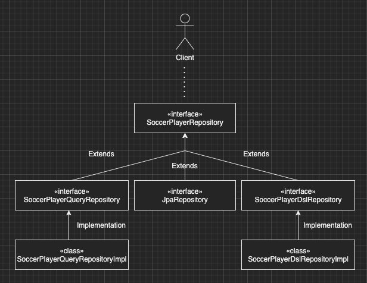
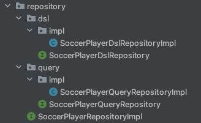

이번 장에서는 Spring Data JPA와 Querydsl을 함께 사용하는 방법에 대해서 알아본다.
글의 하단부에 참고한 강의와 공식문서의 경로를 첨부하였으므로 자세한 사항은 강의나 공식문서에서 확인한다.
모든 코드는 [깃허브 (링크)](https://github.com/roy-zz/querydsl)에 올려두었다.

---

### 리포지토리 구조

Spring Data JPA의 리포지토리는 인터페이스로 이루어져 있으며 개발자가 직접 구현하지 않는다.
하지만 Querydsl을 사용하기 위해서는 조회하기 위한 코드를 직접 작성해야한다. 
Data JPA 리포지토리에서 Querydsl을 사용하는 것은 불가능하며 아래와 같이 리포지토리 구조를 잡아야한다.



**JpaRepository**: Spring Data JPA에서 기본 CRUD를 제공하는 인터페이스
**SoccerPlayerRepository**: 기본 CRUD와 복잡하지 않은 조회 기능을 가지는 리포지토리 인터페이스
**SoccerPlayerDslRepository**: Querydsl용 역할을 명시한 인터페이스
**SoccerPlayerDslRepositoryImpl**: 인터페이스에 명시되어 있는 기능을 구현할 구현체
**SoccerPlayerQueryRepository**: 화면에 특화된 복잡한 Select 역할을 명시한 인터페이스
**SoccerPlayerQueryRepositoryImpl**: 인터페이스에 명시되어 있는 기능을 구현할 구현체

이러한 구조로 리포지토리가 구성되어 있다면 클라이언트 입장에서는 SoccerPlayerRepository만 사용하면 되고
실제로 내가 사용하는 메서드의 구현체는 누구이며 어떻게 구현되어 있는지 알 필요가 없어진다.

패키지 구조는 아래의 이미지와 같다.



---

### SoccerPlayerRepository

클라이언트는 이 리포지토리를 통하여 Query용 리포지토리와 Querydsl용 리포지토리에 접근이 가능하다.

```java
public interface SoccerPlayerRepositoryImpl extends
        JpaRepository<SoccerPlayer, Long>,
        SoccerPlayerQueryRepository,
        SoccerPlayerDslRepository {
}
```

테스트에서 조회 조건으로 사용할 DTO는 아래와 같다.

```java
@Data
public class SoccerPlayerSearchDTO {
    private String playerName;
    private String teamName;
    private Integer heightGt;
    private Integer weightGt;
}
```

테스트에서 사용할 조회용 DTO는 아래와 같다.

```java
@Data
public class SoccerPlayerTeamDTO {
    private Long playerId;
    private String playerName;
    private Long teamId;
    private String teamName;

    @QueryProjection
    public SoccerPlayerTeamDTO(Long playerId, String playerName, Long teamId, String teamName) {
        this.playerId = playerId;
        this.playerName = playerName;
        this.teamId = teamId;
        this.teamName = teamName;
    }
}
```

---

### Querydsl 페이징 연동

Querydsl을 위한 리포지토리 인터페이스는 아래와 같다.

```java
public interface SoccerPlayerDslRepository {
    Page<SoccerPlayerTeamDTO> searchSimplePage(SoccerPlayerSearchDTO dto, Pageable pageable);
    Page<SoccerPlayerTeamDTO> searchComplexPage(SoccerPlayerSearchDTO dto, Pageable pageable);
}
```

반환 타입이 QueryResults<>인 경우 컨텐츠를 조회하는 쿼리와 카운트를 조회하는 쿼리가 두 번 발생한다.

```java
public class SoccerPlayerDslRepositoryImpl implements SoccerPlayerDslRepository {

    private final JPAQueryFactory query;

    public SoccerPlayerDslRepositoryImpl(EntityManager entityManager) {
        this.query = new JPAQueryFactory(entityManager);
    }
    @Override
    public Page<SoccerPlayerTeamDTO> searchSimplePage(SoccerPlayerSearchDTO dto, Pageable pageable) {
        QueryResults<SoccerPlayerTeamDTO> results = query
                .select(new QSoccerPlayerTeamDTO(
                        soccerPlayer.id, soccerPlayer.name,
                        soccerPlayer.team.id, soccerPlayer.team.name))
                .from(soccerPlayer)
                .leftJoin(soccerPlayer.team, team)
                .where(
                        playerNameEq(dto.getPlayerName()),
                        teamNameEq(dto.getTeamName()),
                        heightGt(dto.getHeightGt()),
                        weightGt(dto.getWeightGt()))
                .offset(pageable.getOffset())
                .limit(pageable.getPageSize())
                .fetchResults();

        List<SoccerPlayerTeamDTO> content = results.getResults();
        return new PageImpl<>(content, pageable, results.getTotal());
    }

    private BooleanExpression playerNameEq(String playerName) {
        return Objects.nonNull(playerName) ? soccerPlayer.name.eq(playerName) : null;
    }

    private BooleanExpression teamNameEq(String teamName) {
        return Objects.nonNull(teamName) ? soccerPlayer.team.name.eq(teamName) : null;
    }

    private BooleanExpression heightGt(Integer height) {
        return Objects.nonNull(height) ? soccerPlayer.height.gt(height) : null;
    }

    private BooleanExpression weightGt(Integer weight) {
        return Objects.nonNull(weight) ? soccerPlayer.weight.gt(weight) : null;
    }

}
```

이러한 경우 카운트 쿼리 또한 내용을 가져오는 쿼리랑 동일한 조건으로 조회한다.
하지만 Outer Join의 경우 검색 조건은 동일해야 하지만 Join은 걸리지 않아도 되는 경우가 있다.
이러한 경우 카운트 쿼리를 경량화하여 성능을 올릴 수 있다.

아래의 코드를 살펴보면 처음에 페이징 조건에 맞는 컨텐츠만 조회하였다.
이후 Total Count를 구하는 쿼리를 따로 작성하였는데 불필요한 Join은 제거하였다.
Outer Join의 경우 Team의 유무와 상관없이 SoccerPlayer가 조회되기 때문에 Join의 유무와 상관없이 Total Count는 동일하다.

```java
public class SoccerPlayerDslRepositoryImpl {
    @Override
    public Page<SoccerPlayerTeamDTO> searchComplexPage(SoccerPlayerSearchDTO dto, Pageable pageable) {
        List<SoccerPlayerTeamDTO> content = query
                .select(new QSoccerPlayerTeamDTO(
                        soccerPlayer.id, soccerPlayer.name,
                        soccerPlayer.team.id, soccerPlayer.team.name))
                .from(soccerPlayer)
                .leftJoin(soccerPlayer.team, team)
                .where(
                        playerNameEq(dto.getPlayerName()),
                        teamNameEq(dto.getTeamName()),
                        heightGt(dto.getHeightGt()),
                        weightGt(dto.getWeightGt()))
                .offset(pageable.getOffset())
                .limit(pageable.getPageSize())
                .fetch();

        JPAQuery<Long> countQuery = query
                .select(soccerPlayer.count())
                .from(soccerPlayer)
                .where(
                        playerNameEq(dto.getPlayerName()),
                        teamNameEq(dto.getTeamName()),
                        heightGt(dto.getHeightGt()),
                        weightGt(dto.getWeightGt()));

        return PageableExecutionUtils.getPage(content, pageable, countQuery::fetchOne);
    }
}
```

### Sort

조회용 쿼리를 작성하고 Data JPA의 Sort를 Querydsl의 OrderSpecifier로 변환하여 sort 조건을 장착하고 쿼리를 실행한다.
만약 Sort 조건이 검색의 대상이 되는 Root 엔티티의 범위를 벗어난다면 Sort를 위한 파라미터를 받아서 직접 처리하는 것이 좋다.

```java
public class SoccerPlayerDslRepositoryImpl {
    public Page<SoccerPlayerTeamDTO> searchPageWithSort(SoccerPlayerSearchDTO dto, Pageable pageable) {
        JPAQuery<SoccerPlayerTeamDTO> searchQuery = query
                .select(new QSoccerPlayerTeamDTO(
                        soccerPlayer.id, soccerPlayer.name,
                        soccerPlayer.team.id, soccerPlayer.team.name))
                .from(soccerPlayer)
                .leftJoin(soccerPlayer.team, team)
                .where(
                        playerNameEq(dto.getPlayerName()),
                        teamNameEq(dto.getTeamName()),
                        heightGt(dto.getHeightGt()),
                        weightGt(dto.getWeightGt()))
                .offset(pageable.getOffset())
                .limit(pageable.getPageSize());

        for (Sort.Order o : pageable.getSort()) {
            PathBuilder pathBuilder = new PathBuilder(soccerPlayer.getType(), soccerPlayer.getMetadata());
            searchQuery.orderBy(new OrderSpecifier(o.isAscending() ? Order.ASC : Order.DESC, pathBuilder.get(o.getProperty())));
        }

        List<SoccerPlayerTeamDTO> content = searchQuery.fetch();

        JPAQuery<Long> countQuery = query
                .select(soccerPlayer.count())
                .from(soccerPlayer)
                .where(
                        playerNameEq(dto.getPlayerName()),
                        teamNameEq(dto.getTeamName()),
                        heightGt(dto.getHeightGt()),
                        weightGt(dto.getWeightGt()));

        return PageableExecutionUtils.getPage(content, pageable, countQuery::fetchOne);
    }
}
```

---

**참고한 강의:**

- https://www.inflearn.com/course/Querydsl-%EC%8B%A4%EC%A0%84
- https://www.inflearn.com/course/%EC%8A%A4%ED%94%84%EB%A7%81-%EB%8D%B0%EC%9D%B4%ED%84%B0-JPA-%EC%8B%A4%EC%A0%84
- https://www.inflearn.com/course/%EC%8A%A4%ED%94%84%EB%A7%81%EB%B6%80%ED%8A%B8-JPA-API%EA%B0%9C%EB%B0%9C-%EC%84%B1%EB%8A%A5%EC%B5%9C%EC%A0%81%ED%99%94
- https://www.inflearn.com/course/%EC%8A%A4%ED%94%84%EB%A7%81%EB%B6%80%ED%8A%B8-JPA-%ED%99%9C%EC%9A%A9-1
- https://www.inflearn.com/course/ORM-JPA-Basic

**JPA 공식 문서:** https://docs.spring.io/spring-data/jpa/docs/current/reference/html/#reference

**위키백과:** https://ko.wikipedia.org/wiki/%EC%9E%90%EB%B0%94_%ED%8D%BC%EC%8B%9C%EC%8A%A4%ED%84%B4%EC%8A%A4_API